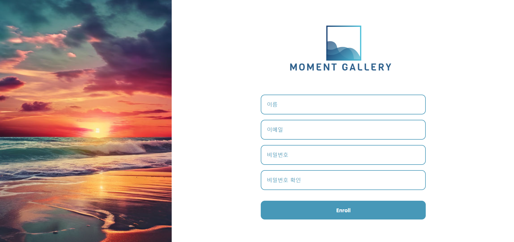

# 예술인들을 위한 작품 홍보 플랫폼 (Moment Gallery)
- 예술인들이 자신의 작품을 홍보할 수 있는 온라인 플랫폼을 만들어 사람들로 하여금 예술에 쉽게 접할 수 있는 환경을 제공하고자 함
- 기술스택: React, Typescript, NodeJS, Express, MongoDB (Mongoose)
- 개인으로 풀스택 기반의 프로젝트를 수행해보니 확실히 디자인, 데이터 로직을 짜는 것에 있어 상당한 부담이 있었으나 이번 프로젝트를 통해 프론트와 백엔드의 API 통신에 보다 익숙해질 수 있었고, 리액트 타입스크립트 기반의 코드 작성을 통해 타입 기반의 안정성이 대규모 프로젝트에서 중요한 역할을 할 수 있다는 것을 체감할 수 있었다.  

# 기능
- jsonwebtoken을 이용한 로그인, 로그아웃 관련 기능 구현
- 이미지 파일 업로드 기능을 통한 예술 작품 업로드 구현
- mongoDB를 연동하여 예술 작품 편집 및 삭제 기능 구현

## 홈 화면

## 로그인

## 사용자 생성

## 작품

## 작품 업로드

## 작품 편집

