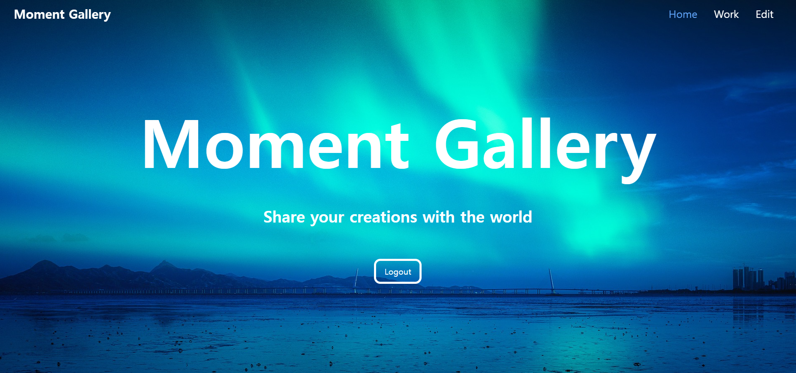

# 예술인들을 위한 작품 홍보 플랫폼

## 프로젝트 배경

- 예술 분야의 경우 매니아층에겐 친숙하지만 다른 사람들의 경우 예술을 접할 수 있는 기회가 많이 없기에 입문하는데 어려움이 있다고 생각했다.
- 만약 예술가들로 하여금 본인들의 작품을 최대한 여러 사람들에게 쉽게 노출시키고, 접할 수 있도록 하는 플랫폼이 있다면 이를 해결해줄 수 있을거라 생각했기에 해당 프로젝트를 진행하게 되었다.

## 프로젝트 기간

- 2024/6 ~ 2024/8 (첫 버전 개발)
- 2024/9 ~ (부족한 UI 나 기능 개발)

## 기술 스택

- Frontend : React, Typescript, TailwindCSS, Context-API
- Backend: Express, Mongoose, JWT(JSON Web Token)

## 기능

#### 홈 화면

;

## 문제점 및 해결

- 프론트 측에서 파일 생성을 위해 이미지를 전송했을 때, 백엔드에서 작품들에 대해 GET 요청을 보냈지만 작품들이 제대로 렌더링 되지 않는 문제점 발생 -> 백엔드 단에서 이미지를 저장하고 있는 폴더를 통해 이미지를 정적으로 제공하게 수정하여 해결하였음
- 사진 업로드 기능을 위해 일반 useState의 객체 내부에 image를 넣었으나 정상적으로 사진 파일이 업로드되지 않는 문제점 발생 -> formData 객체 형태로 백엔드에 파일을 제공하도록 하여 백엔드 측에서 multer 패키지를 활용해 이미지 파일에 대한 정상적인 처리를 수행핳 수 있었음.

## I Learn

- 혼자 풀스택 프로젝트를 개발해보며, 데이터 간의 통신 로직과 흐름에 대해 공부할 수 있었다.
- JWT를 활용한 인증 로직을 구현하며, 로그인, 로그아웃 관련 기능 개발에 익숙해질 수 있었다.
