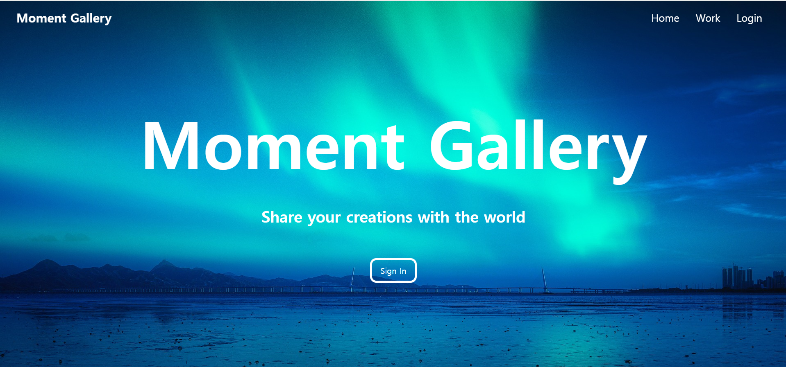
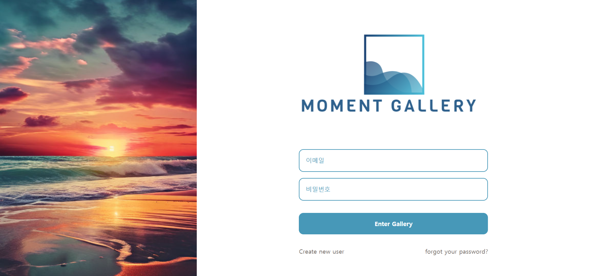

# 예술인들을 위한 작품 홍보 플랫폼 (Moment Gallery)
- 예술인들이 자신의 작품을 홍보할 수 있는 온라인 플랫폼을 만들어 사람들로 하여금 예술에 쉽게 접할 수 있는 환경을 제공하고자 함
- 기술스택: React, Typescript, NodeJS, Express, MongoDB (Mongoose)

# 기능
- jsonwebtoken을 이용한 로그인, 로그아웃 관련 기능 구현
- 이미지 파일 업로드 기능을 통한 예술 작품 업로드 구현
- mongoDB를 연동하여 예술 작품 편집 및 삭제 기능 구현

## 홈 화면

## 작품 페이지

## 로그인 페이지

